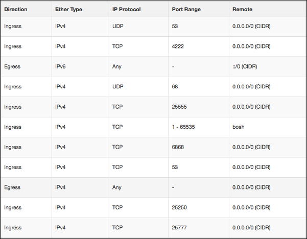
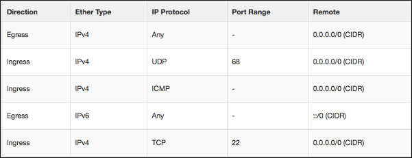
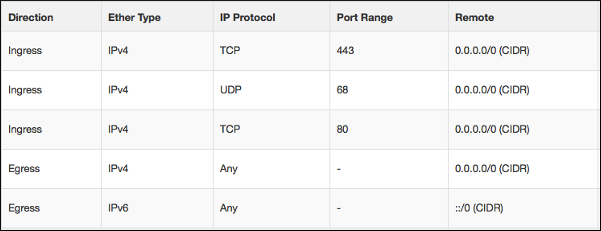
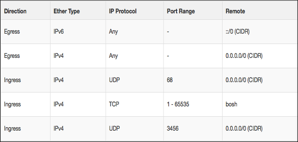

AWS and OpenStack offer Security Groups as a mechanism to restrict inbound traffic to servers. 

The examples below show the Security Groups that are referenced in other sections of this documentation.

## bosh

## ssh

## cf-public

## cf-private

